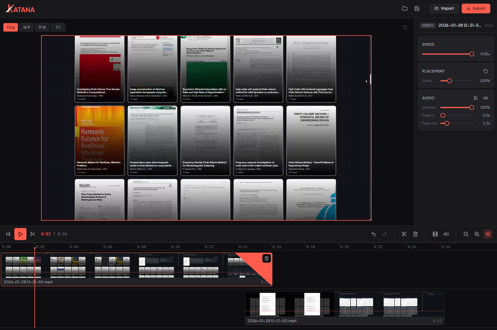
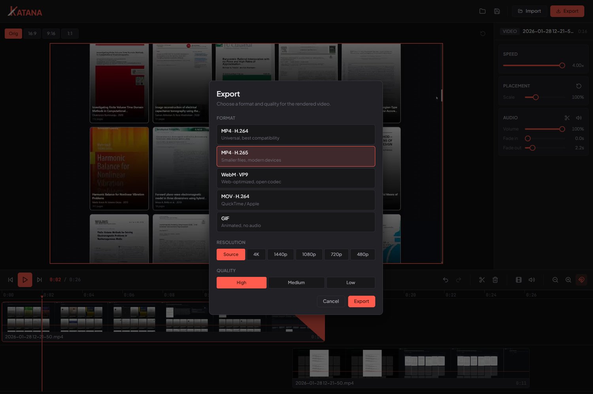

<p align="center">
  
</p>

<p align="center"><b>A fast, minimalist video editor.</b></p>

<p align="center">Trim, cut and concatenate clips, the part of the job you'd otherwise open Clipchamp for, without the sluggish UX.</p>

<p align="center">
  
  
</p>

---

## What it is

Katana is a lightweight desktop video editor: import clips, compose them on a multitrack timeline, add titles, and export. It's built to feel instant, the heavy lifting is done with native FFmpeg and lossless stream-copy where possible, so a simple cut is I/O-bound rather than a full re-encode.

## Features

- **Multitrack compositing**: layer clips on a viewport canvas, place, scale and snap (picture in picture, split screen, overlays)
- **Text overlays**: styled titles with a font, color, alignment and outline, placed, scaled and faded like any clip
- **Mixed frame rates**: the timeline runs at the fastest clip's frame rate; slower clips are frame-held to match
- **Frame-accurate editing**: step the playhead frame by frame, split at the playhead, trim by dragging clip edges
- **Audio you control**: detach audio to its own track, import music, mix and fade, with waveforms and audio scrubbing
- **Fast export**: MP4 (H.264 / H.265), WebM (VP9), MOV and GIF, with a lossless stream-copy fast path
- **Snappy UX**: GPU-accelerated dragging, instant scrubbing, undo / redo and a command palette (`Cmd/Ctrl` + `K`)
- **Import** via native file dialog or drag-and-drop, with filmstrip previews on every clip
- **Project save / load** to a small `.katana` file

## Keyboard shortcuts

| Key | Action |
| --- | --- |
| `Space` | Play / pause |
| `←` / `→` | Step one frame |
| `Shift` + `←` / `→` | Step ±1 second |
| `,` / `.` | Step one frame (alternative) |
| `↑` / `↓` | Previous / next clip |
| `Home` / `End` | Jump to start / end |
| `S` | Split at playhead |
| `T` | Add text overlay |
| `Delete` / `Backspace` | Delete selected clip |
| `Cmd/Ctrl` + `Z` | Undo (`Shift` to redo) |
| `Cmd/Ctrl` + `S` / `O` | Save / open project |
| `Cmd/Ctrl` + `K` | Command palette |

## Tech stack

- **[Tauri 2](https://tauri.app)** desktop shell (Rust core, ~native window)
- **[SvelteKit](https://svelte.dev)** + **Svelte 5 runes** UI, static SPA
- **Vanilla CSS** with a fully tokenized design system
- **FFmpeg** sidecar for export (stream-copy first)

## Platforms

Katana ships for **Windows** (NSIS / MSI) and **Linux** (AppImage / `.deb`),
64-bit. Grab the installer for your platform from the
[latest release](https://github.com/milanofthe/katana/releases). Releases are
built for both platforms in CI on every version tag.

## Development

Requires Node, Rust and the [Tauri prerequisites](https://tauri.app/start/prerequisites/).
On Debian/Ubuntu the Tauri 2 system packages are:

```sh
sudo apt-get install libwebkit2gtk-4.1-dev libayatana-appindicator3-dev \
  librsvg2-dev libxdo-dev patchelf file
```

FFmpeg and ffprobe ship as bundled sidecars and are **not** committed (they are
large). Fetch them once before the first `dev` / `build`:

```sh
# Windows (PowerShell)
pwsh -File scripts/fetch-ffmpeg.ps1
# Linux
bash scripts/fetch-ffmpeg.sh
```

Text-overlay fonts (TTF) are likewise fetched, not committed. They are used both
for the preview and, via the same files, by the FFmpeg exporter so text matches:

```sh
# Windows (PowerShell)
pwsh -File scripts/fetch-fonts.ps1
# Linux
bash scripts/fetch-fonts.sh
```

Then:

```sh
npm install
npm run tauri dev     # run the desktop app (Vite on :1420)
npm run check         # type-check
npm run tauri build   # production build
```

## License

[MIT](LICENSE) © Milan Rother.

Bundled fonts (Plus Jakarta Sans, JetBrains Mono, Inter, Archivo Black,
Playfair Display) are licensed under the
[SIL Open Font License 1.1](https://openfontlicense.org/) and retain their own license.
